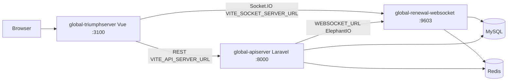

# 서비스 연동 맵

> `repos.lock.json` 기준 조사 (2026-05-20). 포트·URL은 로컬 기본값이며, 팀 `.env`에 따라 달라질 수 있습니다.

## 아키텍처

## 저장소 요약

| Repo | 스택 | 로컬 진입점 | 기본 포트 |
|------|------|-------------|-----------|
| global-apiserver | Laravel 10, PHP 8.1+ | `php artisan serve` | 8000 |
| global-renewal-websocket | Node, TS, Express, Socket.IO, Prisma | `npm run dev` | 9603 (`PORT`) |
| global-triumphserver | Vue 3, Vite, Pinia | `npm run dev:proxy` | 3100 (vite.config.js) |

## 기동 순서 (로컬)

1. MySQL / Redis (팀 dev 인스턴스 또는 로컬)
2. **global-apiserver** — API·인증·비즈니스 로직
3. **global-renewal-websocket** — 실시간 채팅·브래킷 이벤트
4. **global-triumphserver** — UI (API·WS URL 필요)

## 환경 변수 (핵심)

### global-apiserver (`repos/global-apiserver/.env`)

| 변수 | 용도 |
|------|------|
| `APP_URL` | Laravel 앱 URL |
| `DB_*` | MySQL |
| `REDIS_*` | Redis |
| `WEBSOCKET_URL` | API → WebSocket emit (`WebsocketService`) |

### global-renewal-websocket (`repos/global-renewal-websocket/.env`)

| 변수 | 용도 |
|------|------|
| `PORT` | HTTP + Socket.IO (기본 **9603**, `src/app.ts`) |
| `DATABASE_URL` | Prisma MySQL |
| `REDIS_URL` | Socket.IO Redis adapter |
| `SOCKET_CORS_ORIGIN` | CORS (기본 `*`) |

Health: `GET http://127.0.0.1:9603/health`

### global-triumphserver

| 변수 | 용도 |
|------|------|
| `VITE_API_SERVER_URL` | REST API (`src/plugins/axios.js`) |
| `VITE_SOCKET_SERVER_URL` | Socket.IO (`src/store/socket.js`) |
| `VITE_ACCESS_TOKEN_KEY` | 쿠키 키 |
| `VITE_SERVICE_NAME` | API `service` 파라미터 |

로컬 API 연동: `npm run dev:proxy` (`vite --mode proxy`) — `.env.proxy` 필요.

## 프로세스 식별 (stop-all)

| 서비스 | 포트 | 프로세스 힌트 |
|--------|------|----------------|
| API | 8000 | `php` (artisan serve) |
| WebSocket | 9603 | `node` (ts-node / nodemon) |
| Frontend | 3100 | `node` (vite) |

## 배포 (분리 유지)

DB·릴리즈 순서: [db-deployment.md](./db-deployment.md) · Cursor 세션 **배포 깃**

| Repo | 배포 힌트 |
|------|-----------|
| global-renewal-websocket | AWS CodeDeploy (`appspec.yml`), PM2 (`npm run start:socket` 등) |
| global-apiserver | Laravel 배포 파이프라인 (팀 표준) |
| global-triumphserver | `npm run build` / PM2 (`pm2.qa.json` 등) |

`triumph_ai`는 **로컬 오케스트레이션 전용**이며 운영 배포 아티팩트에 포함하지 않습니다.
